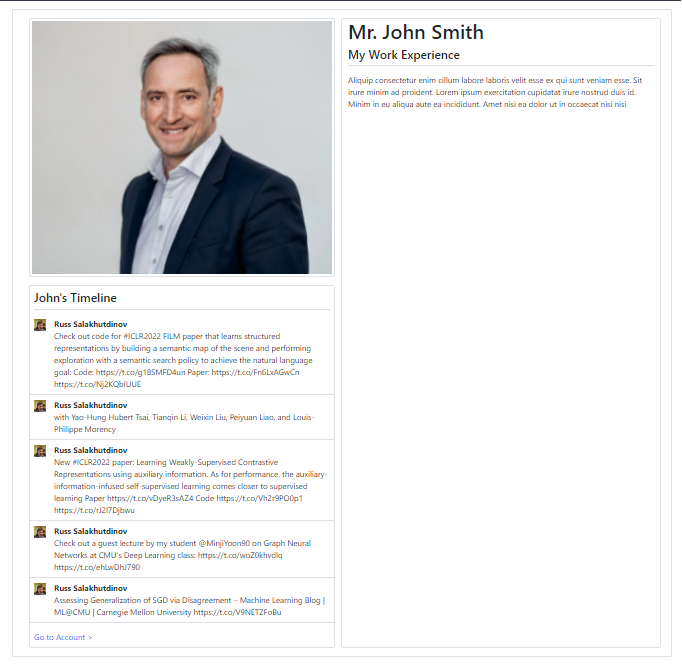

# Portafolio Java Web App 
Develop Time: 10 hours.

## Description
### Part I
Simple portfolio Java web app that displays the profile image, name, some text with
the experience and a 5 tweet list of the user’s Twitter timeline.
### Part II
A REST API with two endpoints that allows the consumer to get and
modify the profile information.
### Mockup


## Software Prerequisites
* MySql Database
* Java 11
* Maven
* NPM
* Twitter Development Account

## Steps to Build the App
```
git clone https://github.com/Antizana/TwitterTimeline.git
```
Modify the file application.properties and add the MySQL configuration parameters

```
spring.datasource.url= -- Database connection string
spring.datasource.dbname= -- Database name
spring.datasource.username= -- Database user name
spring.datasource.password= -- Database user password
spring.datasource.driver-class-name=com.mysql.cj.jdbc.Driver
```
Modify the file twitter4j.properties and add the Twitter configuration parameters
```
loggerFactory=twitter4j.StdOutLoggerFactory
jsonStoreEnabled=true
debug=false
oauth.consumerKey= -- API Key
oauth.consumerSecret= -- API Key Secret
oauth.accessToken= -- Access Token
oauth.accessTokenSecret= -- Access Token Secret
```

Open a terminal and change to the TwitterTimeline directory

```
cd backend
mnw clean install
mvnw spring-boot:run
```

```
cd ../frontend
npm install
npm start
```

Open the http://localhost:3000/ site in a browser 

## Technologies Used
### Backend
* Java 11
* Spring Boot 2.6.4+
* Spring JPA 2.6.4+
* MySql Java Connector 8.0.28+
* Twitter4j 4.0.7
* JUnit
* Mockito
### Frontend
* React 17.0.2+
* React-Router 6.2.2+
* React-Bootstrap 2.2.2+
* Bootstrap 5.1.3+
* Axios 0.26.1+
### Utils
* git
* IntelliJ IDEA
* VSCode

## Api Endpoints
### Retrieve Portfolio Information
```
curl --location --request GET 'http://localhost:8080/api/v1/profile/117'
```
```
[
    {
        "idPortfolio": 117,
        "description": "Description",
        "experience_summary": "Aliquip consectetur enim cillum labore laboris velit esse ex qui sunt veniam esse. Sit irure minim ad proident. \n\nLorem ipsum exercitation cupidatat irure nostrud duis id. Minim in eu aliqua aute ea incididunt. Amet nisi ea dolor ut in occaecat nisi nisi ",
        "id": 0,
        "imageUrl": "https://www.mantruckandbus.com/fileadmin/media/bilder/02_19/219_05_busbusiness_interviewHeader_1485x1254.jpg",
        "lastNames": "Smith",
        "names": "John",
        "tittle": "Mr.",
        "twitterUserId": "2956121356",
        "twitterUserName": "rsalakhu",
        "userId": "User Id",
        "address": "Address",
        "email": "Email",
        "experience": "Experience",
        "imagePath": "Image Path",
        "name": "Name",
        "phone": "Phone",
        "twitterUser": "Twitter User",
        "zipCode": "Zip code",
        "title": "Title"
    }
]
```
###Update Profile Information
```
curl --location --request PUT 'http://localhost:8080/api/v1/profile' \
--header 'Content-Type: application/json' \
--data-raw '{
    "idPortfolio": 116,
    "description": "Profile Description",
    "experience_summary": "Experience Summary",
    "id": 0,
    "imageUrl": "Image Url",
    "lastNames": "Last Names",
    "names": "Names",
    "tittle": "title",
    "twitterUserId": "Twitter User Id",
    "twitterUserName": "Twitter User Name",
    "userId": "User Id",
    "address": "Address",
    "email": "Email",
    "experience": "Experience",
    "imagePath": "Image Path",
    "name": "Name",
    "phone": "Phone",
    "twitterUser": "Twitter User",
    "zipCode": "Zip code",
    "title": "Title"
}'
```
### Twitter
```
curl --location --request GET 'http://localhost:8080/api/v1/twitter/2956121356'
```
```
[
    {
        "id": 1503120030648750080,
        "userName": "Russ Salakhutdinov",
        "text": "Check out code for #ICLR2022 FILM paper that learns structured representations by building a semantic map of the scene and performing exploration with a semantic search policy to achieve the natural language goal:\n \nCode: https://t.co/g18SMFD4un\nPaper: https://t.co/Fn6LxAGwCn https://t.co/Nj2KQbIUUE",
        "photo": "http://pbs.twimg.com/profile_images/550901065751592963/J3wFUStk_mini.jpeg"
    },
    {
        "id": 1503117263234379776,
        "userName": "Russ Salakhutdinov",
        "text": "with Yao-Hung Hubert Tsai, Tianqin Li, Weixin Liu, Peiyuan Liao, and Louis-Philippe Morency",
        "photo": "http://pbs.twimg.com/profile_images/550901065751592963/J3wFUStk_mini.jpeg"
    },
    {
        "id": 1503117089778851843,
        "userName": "Russ Salakhutdinov",
        "text": "New #ICLR2022 paper: Learning Weakly-Supervised Contrastive Representations using auxiliary information.\n\nAs for performance, the auxiliary-information-infused self-supervised learning comes closer to supervised learning\n\nPaper https://t.co/vDyeR3sAZ4\nCode https://t.co/Vh2r9PO0p1 https://t.co/rJ2l7Djbwu",
        "photo": "http://pbs.twimg.com/profile_images/550901065751592963/J3wFUStk_mini.jpeg"
    },
    {
        "id": 1500899817203109888,
        "userName": "Russ Salakhutdinov",
        "text": "Check out a guest lecture by my student @MinjiYoon90 on Graph Neural Networks at CMU's Deep Learning class:\n\nhttps://t.co/woZ0khvdlq https://t.co/ehLwDhJ790",
        "photo": "http://pbs.twimg.com/profile_images/550901065751592963/J3wFUStk_mini.jpeg"
    },
    {
        "id": 1499871128780693508,
        "userName": "Russ Salakhutdinov",
        "text": "Assessing Generalization of SGD via Disagreement – Machine Learning Blog | ML@CMU | Carnegie Mellon University https://t.co/V9NETZFoBu",
        "photo": "http://pbs.twimg.com/profile_images/550901065751592963/J3wFUStk_mini.jpeg"
    }
]
```
